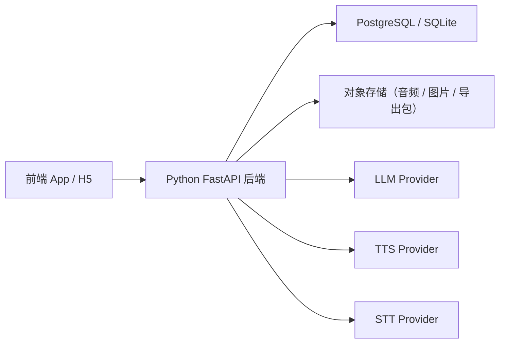
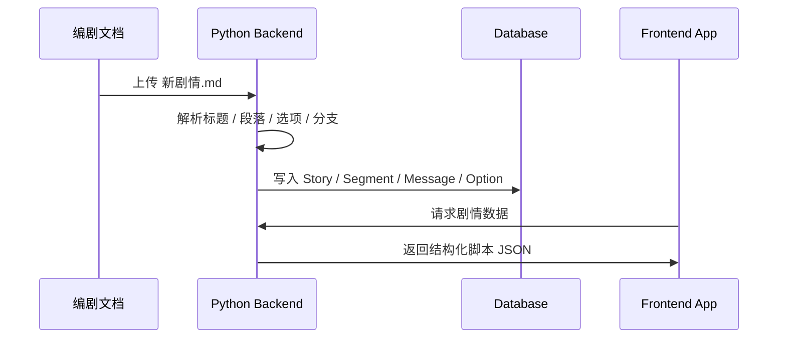
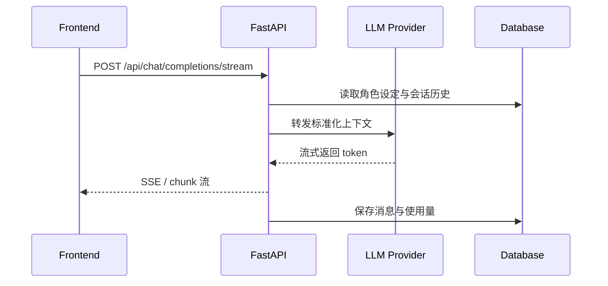

# 相｜详细设计说明书

## 1. 文档目的

本文档用于明确《相》项目的详细设计方案，覆盖前端应用、剧情数据接入、以及新增的 Python 轻量后端设计。  
当前项目不再把所有能力都压在前端本地处理，而是引入一个专门的后端服务层，用于统一处理：

- LLM 对话请求与流式输出
- TTS 文本转语音
- STT 语音转文本
- 角色、剧情、会话、设置等信息存储
- 文档导入与数据导出
- 文件与音频资源管理

## 2. 总体架构

### 2.1 架构目标

系统采用“前端应用 + Python 轻量后端 + 数据存储”的三层结构：

1. 前端负责 UI、交互、剧情播放、聊天展示、游戏界面与设置页面。
2. 后端负责 AI 能力接入、资源处理、数据持久化、导入导出与统一 API。
3. 数据层负责结构化数据、媒体资源和缓存。

### 2.2 技术选型

#### 前端

- 框架：Vue 3
- 构建：Vite
- 状态管理：Pinia
- 路由：Vue Router
- 目标形态：先支持 H5，后续可扩展为移动端壳或 uni-app 原生包

#### 后端

- 语言：Python 3.11+
- 框架：FastAPI
- 校验模型：Pydantic
- HTTP 客户端：httpx
- ORM：SQLAlchemy 或 SQLModel
- 异步任务：FastAPI BackgroundTasks，必要时扩展为 Celery / RQ
- 服务特征：轻量、异步、接口清晰、易于扩展

#### 存储

- 主数据库：PostgreSQL
- 本地轻量部署可选：SQLite
- 对象存储：本地文件目录 / MinIO
- 缓存：Redis（可选，用于会话缓存、限流、任务状态）

### 2.3 部署拓扑



## 3. 前端详细设计

### 3.1 前端职责

前端只处理展示和交互，不直接承担 AI 核心能力。

主要职责：

- 角色列表、详情、编辑
- 主线剧情播放
- 自由聊天界面
- 小游戏入口与状态展示
- 设置、API 配置、导出入口
- 调用后端 API 并渲染结果

### 3.2 前端模块划分

#### 角色模块

- 页面：`pages/character/*`
- 能力：角色创建、编辑、展示、收藏、筛选

#### 剧情模块

- 页面：`pages/dialogue/feed.vue`
- 能力：脚本化对话播放、分支选项、系统提示、重开

#### 聊天模块

- 页面：`pages/chat/chat.vue`
- 能力：与后端进行流式聊天、发送文本、图片、语音

#### 游戏模块

- 页面：`pages/game/*`
- 能力：小游戏展示、结果回写聊天或剧情状态

#### 设置模块

- 页面：`pages/settings/*`
- 能力：语音、导出、全局提示词、API 测试与用户信息

### 3.3 前端与剧情数据的关系

主线剧情采用“源 Markdown + 编译后脚本数据”的方式接入：

1. 编剧源文件维护在 `docs/新剧情.md`
2. 导入脚本读取该文件
3. 生成结构化脚本数据文件
4. 前端剧情页直接读取结构化数据，不在运行时解析 Markdown

当前结构化数据文件：

- `src/data/story.generated.ts`
- `src/data/story.ts`

这意味着：

- `新剧情.md` 是编辑源文件
- `story.generated.ts` 是游戏本体内实际运行的数据

## 4. 后端详细设计

## 4.1 后端职责边界

后端统一接管以下原本可能散落在前端或本地脚本中的能力：

- LLM 对话请求封装与流式转发
- TTS 音频生成与缓存
- STT 音频识别与结果清洗
- 角色、会话、消息、剧情、游戏状态存储
- 文档导入、剧情导入、导出打包
- 文件上传、音频文件、图片文件管理
- 配置管理、限流、日志、异常处理

前端不再直接存储核心业务数据，也不直接调用外部大模型接口。

## 4.2 后端目录建议

```text
backend/
├── app/
│   ├── api/
│   │   ├── routes/
│   │   │   ├── health.py
│   │   │   ├── auth.py
│   │   │   ├── chat.py
│   │   │   ├── tts.py
│   │   │   ├── stt.py
│   │   │   ├── characters.py
│   │   │   ├── story.py
│   │   │   ├── sessions.py
│   │   │   ├── files.py
│   │   │   └── export.py
│   ├── core/
│   │   ├── config.py
│   │   ├── logging.py
│   │   ├── security.py
│   │   └── dependencies.py
│   ├── models/
│   │   ├── character.py
│   │   ├── story.py
│   │   ├── session.py
│   │   ├── message.py
│   │   └── asset.py
│   ├── schemas/
│   │   ├── character.py
│   │   ├── story.py
│   │   ├── chat.py
│   │   ├── tts.py
│   │   ├── stt.py
│   │   └── export.py
│   ├── services/
│   │   ├── llm_service.py
│   │   ├── tts_service.py
│   │   ├── stt_service.py
│   │   ├── story_service.py
│   │   ├── import_service.py
│   │   ├── export_service.py
│   │   └── storage_service.py
│   ├── repositories/
│   │   ├── character_repo.py
│   │   ├── story_repo.py
│   │   ├── session_repo.py
│   │   └── asset_repo.py
│   ├── tasks/
│   │   ├── tts_tasks.py
│   │   └── export_tasks.py
│   └── main.py
├── tests/
├── migrations/
├── storage/
│   ├── uploads/
│   ├── audio/
│   └── exports/
└── requirements.txt
```

## 4.3 核心服务设计

### 4.3.1 LLM 服务

职责：

- 接收前端会话上下文
- 组装 system prompt、角色设定、历史消息
- 转发到 OpenAI 或兼容接口
- 支持流式返回
- 记录 token 使用量、耗时、异常

建议接口：

- `POST /api/chat/completions`
- `POST /api/chat/completions/stream`

输入：

- 角色 ID
- 会话 ID
- 消息数组
- 模型配置
- 可选图片 / 附件引用

输出：

- 标准化回复文本
- 流式 chunk
- token 统计
- 错误码与可展示错误信息

### 4.3.2 TTS 服务

职责：

- 接收文本、音色、语速等参数
- 调用 TTS Provider
- 把生成音频存入对象存储
- 返回音频 URL 或资源 ID

建议接口：

- `POST /api/tts/synthesize`
- `GET /api/tts/{asset_id}`

处理方式：

- 短文本可同步处理
- 长文本使用后台任务异步生成

### 4.3.3 STT 服务

职责：

- 接收音频文件
- 调用 STT Provider
- 做结果清洗与格式标准化
- 返回识别文本与置信度

建议接口：

- `POST /api/stt/transcribe`

支持：

- `wav`
- `mp3`
- `m4a`
- `webm`

### 4.3.4 存储服务

职责：

- 统一读写角色、剧情、会话、消息、游戏状态
- 统一封装数据库与对象存储
- 提供前端需要的聚合数据结构

不建议继续让前端把业务主数据长期放在 `localStorage` 中。

### 4.3.5 导入服务

职责：

- 接收 Markdown / TXT / JSON / CSV
- 解析剧情文档或角色文档
- 转为标准结构化数据
- 写入数据库

建议接口：

- `POST /api/import/character`
- `POST /api/import/story`

剧情导入逻辑可复用当前 `新剧情.md -> 结构化脚本` 的解析思路，但迁移到后端执行更稳妥。

### 4.3.6 导出服务

职责：

- 导出角色配置
- 导出会话记录
- 导出剧情脚本 JSON
- 导出完整备份包

建议接口：

- `POST /api/export/session`
- `POST /api/export/character`
- `POST /api/export/full`
- `GET /api/export/tasks/{task_id}`

## 4.4 数据模型设计

### 4.4.1 Character

字段：

- `id`
- `name`
- `avatar_url`
- `background_url`
- `description`
- `greeting`
- `settings`
- `mode`
- `category`
- `sub_category`
- `personality`
- `behavior`
- `values`
- `tags`
- `created_at`
- `updated_at`

### 4.4.2 Story

字段：

- `id`
- `title`
- `source_name`
- `source_format`
- `version`
- `character_name`
- `entry_day`
- `created_at`
- `updated_at`

### 4.4.3 StorySegment

字段：

- `id`
- `story_id`
- `segment_type`：`messages | choice`
- `scene`
- `prompt`
- `sort_order`

### 4.4.4 StoryMessage

字段：

- `id`
- `segment_id`
- `role`：`me | other | system`
- `text`
- `variant`
- `delay_ms`
- `typing_ms`
- `hidden`
- `sort_order`

### 4.4.5 StoryChoiceOption

字段：

- `id`
- `segment_id`
- `key`
- `text`
- `retry`
- `sort_order`

### 4.4.6 Session / Message

#### Session

- `id`
- `character_id`
- `title`
- `mode`
- `message_count`
- `created_at`
- `updated_at`

#### Message

- `id`
- `session_id`
- `role`
- `content`
- `content_type`
- `asset_id`
- `token_usage`
- `created_at`

### 4.4.7 Asset

字段：

- `id`
- `asset_type`：`image | audio | file | export`
- `storage_path`
- `mime_type`
- `size`
- `owner_type`
- `owner_id`
- `created_at`

## 4.5 API 设计

### 4.5.1 健康检查

- `GET /api/health`

返回：

- 服务状态
- 数据库状态
- 对象存储状态
- LLM Provider 状态（可选）

### 4.5.2 角色接口

- `GET /api/characters`
- `GET /api/characters/{character_id}`
- `POST /api/characters`
- `PUT /api/characters/{character_id}`
- `DELETE /api/characters/{character_id}`

### 4.5.3 剧情接口

- `GET /api/story/{story_id}`
- `GET /api/story/{story_id}/segments`
- `POST /api/story/import`
- `POST /api/story/compile`

### 4.5.4 会话接口

- `GET /api/sessions`
- `GET /api/sessions/{session_id}`
- `GET /api/sessions/{session_id}/messages`
- `POST /api/sessions`
- `DELETE /api/sessions/{session_id}`

### 4.5.5 聊天接口

- `POST /api/chat/completions`
- `POST /api/chat/completions/stream`

### 4.5.6 语音接口

- `POST /api/tts/synthesize`
- `POST /api/stt/transcribe`

### 4.5.7 导入导出接口

- `POST /api/import/character`
- `POST /api/import/story`
- `POST /api/export/full`
- `POST /api/export/session`
- `GET /api/export/tasks/{task_id}`

## 4.6 关键流程

### 4.6.1 剧情导入流程



### 4.6.2 流式聊天流程



### 4.6.3 语音流程

#### TTS

1. 前端提交文本
2. 后端请求 TTS Provider
3. 后端落盘音频
4. 后端返回资源地址
5. 前端播放

#### STT

1. 前端上传音频
2. 后端执行识别
3. 后端清洗文本
4. 前端得到可直接发给聊天或剧情系统的文字

## 5. 安全与运维

### 5.1 安全要求

- API Key 只保存在后端环境变量，不暴露给前端
- 文件上传限制大小、类型、数量
- 对聊天、TTS、STT 接口做限流
- 导入文件做扩展名和内容校验
- 导出接口带任务权限控制

### 5.2 日志要求

后端应记录：

- 请求耗时
- Provider 调用状态
- 错误堆栈
- 关键任务状态
- 导入导出任务日志

### 5.3 配置项

建议环境变量：

- `APP_ENV`
- `DATABASE_URL`
- `REDIS_URL`
- `OPENAI_API_KEY`
- `OPENAI_BASE_URL`
- `TTS_PROVIDER`
- `STT_PROVIDER`
- `MEDIA_ROOT`
- `EXPORT_ROOT`

## 6. 当前实现与目标实现的差异

### 6.1 当前实现

- 前端已有角色、聊天、剧情页、设置页
- 主线剧情已可由结构化数据驱动播放
- 当前 AI 能力仍偏前端直连 Provider
- 当前存储仍以本地为主

### 6.2 目标实现

- 所有 AI 能力经由 Python FastAPI 后端统一处理
- 剧情、角色、会话改为服务端持久化
- 导入导出完全迁移到后端
- 支持更稳定的 H5 与移动端打包形态

## 7. 结论

本项目后续推荐采用：

- 前端：Vue 3 + Vite，负责交互与展示
- 后端：Python + FastAPI，作为统一业务与 AI 能力中台
- 数据层：PostgreSQL / SQLite + 对象存储

这样可以把 LLM、TTS、STT、存储、导入导出等职责从前端剥离出来，降低前端复杂度，也更适合后续做真正的移动端 App。
