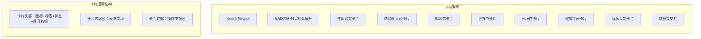

# 角色卡片化封装架构设计

## 1. 需求概述

### 1.1 设计目标
将角色创建/编辑流程重构为模块化的卡片式设计，每个卡片专注于一个特定的配置领域，提升用户体验和代码可维护性。

### 1.2 核心卡片列表

| 卡片名称 | 核心内容 | 状态 |
|---------|---------|-----|
| 基础信息卡片 | 头像、名称、一句话描述、分类、标签、负向特征、物理特征、语言习惯 | ✅ 新增 |
| 整体设定卡片 | 完整设定、多重情境开场白池、负向特征、物理特征、语言习惯、系统级越狱与排版规范、示例对话 | ✅ 新增 |
| 结构化人设卡片 | 身份锁（锚点）、性格特质、交流风格 | ✅ 已有，需增强 |
| 知识书卡片 | 扫描消息数、关键词、内容、插入位置（8种）、深度、角色、优先级、动态注释/心理锚点 | ✅ 已有，需增强 |
| 世界书卡片 | 世界书名称、扫描消息数、关键词、内容、插入位置、深度、角色、优先级、触发概率、注释、动态角色注释、契合度指标、关系阶段触发条件 | ✅ 已有，需增强 |
| 开场白卡片 | 主开场白、备选开场白、多重情境开场白池、情境标签 | ✅ 新增独立卡片 |
| 深度提示卡片 | 深度层级、角色定位、提示内容、动态注释/心理锚点 | ✅ 已有，需增强 |
| 媒体设定卡片 | 画风权重、聊天背景、全局动态视频、角色切换动图、情感表达动图、亲密度触发机制、TTS音色/权重 | ✅ 已有，需增强 |

---

## 2. TypeScript 类型定义设计

### 2.1 基础接口扩展 (`types/character.ts`)

```typescript
// ============== 新增类型 ==============

/** 负向特征与行为禁忌 */
export interface NegativeTraits {
  forbiddenTopics: string[]      // 禁忌话题
  forbiddenBehaviors: string[]   // 禁忌行为
  forbiddenWords: string[]       // 禁语词汇
  responseRules: string          // 触发禁忌时的回应规则
}

/** 客观物理特征 */
export interface PhysicalFeatures {
  appearance: string             // 外貌特征
  clothing: string               // 穿着风格
  bodyType: string               // 体型特征
  ageRange: string               // 年龄范围
  voiceTimbre: string            // 音色特征
  otherFeatures: string[]        // 其他特征
}

/** 语言习惯与语用特征 */
export interface SpeechPatterns {
  sentenceStyle: string          // 句式风格
  vocabulary: string             // 词汇偏好
  speed: string                  // 语速
  emotion: string                // 情感表达倾向
  fillerWords: string[]          // 口头禅/填充词
  punctuation: string            // 标点习惯
  responseLength: string         // 回复长度偏好
}

/** 开场白情境类型 */
export type GreetingContext = 
  | 'first_meeting'              // 初见
  | 'reunion'                    // 重逢
  | 'conflict'                   // 冲突场景
  | 'comfort'                    // 安抚场景
  | 'task_start'                 // 任务开始
  | 'group_entry'                // 群聊入场
  | 'morning'                    // 早安
  | 'night'                      // 晚安
  | 'birthday'                   // 生日
  | 'custom'                     // 自定义

/** 多重情境开场白 */
export interface ContextualGreeting {
  id: string
  context: GreetingContext
  content: string
  enabled: boolean
  priority: number
}

/** 系统级越狱与输出排版规范 */
export interface OutputFormatRules {
  jailbreakPrompt: string        // 越狱提示词
  formatRules: string            // 排版规则
  characterBoundary: string      // 角色身份边界
  forbiddenFormats: string[]     // 禁止的输出格式
  requiredFormats: string[]      // 强制输出格式
}

/** 上下文控制词条 */
export interface ContextControlEntry {
  dynamicAnchor: string          // 动态角色注释/心理锚点
  userPersonaTags: string[]      // 用户画像标签
  intimacyTrigger: string        // 亲密度触发条件
  relationshipStage: string      // 关系阶段
}

/** 媒体权重配置 */
export interface MediaWeights {
  artStyle: Record<string, number>  // 画风权重
  backgroundWeight: number          // 背景权重
  animationWeight: number           // 动效权重
}

/** 亲密度触发媒体 */
export interface IntimacyMediaTrigger {
  threshold: number             // 亲密度阈值
  mediaType: 'background' | 'animation' | 'voice' | 'video'
  mediaUrl: string
  description: string
}

/** TTS音色配置 */
export interface TTSConfig {
  voiceId: string
  voiceName: string
  weight: number                // 权重 0-100
  emotionMapping: Record<string, string>  // 情感映射
}

// ============== 扩展已有接口 ==============

export interface ICharacter {
  // ... 保留原有字段 ...
  
  // 新增字段
  negativeTraits?: NegativeTraits
  physicalFeatures?: PhysicalFeatures
  speechPatterns?: SpeechPatterns
  contextualGreetings?: ContextualGreeting[]
  outputFormatRules?: OutputFormatRules
  contextControl?: ContextControlEntry
  mediaWeights?: MediaWeights
  intimacyMediaTriggers?: IntimacyMediaTrigger[]
  ttsConfigs?: TTSConfig[]
  exampleDialogue?: string[]   // 改为数组支持多段示例对话
}
```

### 2.2 知识书与世界书类型增强 (`types/world-book.ts`)

```typescript
// 扩展 WorldBookEntry
export interface WorldBookEntry {
  // ... 保留原有字段 ...
  
  // 新增强化字段
  dynamicAnchor?: string        // 动态角色注释/心理锚点
  userPersonaTags?: string[]    // 用户画像标签
  relationshipTrigger?: string  // 关系阶段触发条件
  affinityScore?: number        // 契合度指标 0-100
  triggerProbability?: number   // 触发概率 %
}

// 扩展 LorebookEntry (知识书)
export interface LorebookEntry {
  // ... 保留原有字段 ...
  
  // 新增强化字段
  dynamicAnchor?: string
  userPersonaTags?: string[]
}
```

---

## 3. UI 卡片布局设计

### 3.1 创建页与编辑页统一架构



### 3.2 卡片统一设计规范

```vue
<!-- 统一卡片组件：components/CharacterForm/ConfigCard.vue -->
<template>
  <div class="config-card" :class="{ filled: hasContent, error: hasErrors }">
    <!-- 卡片头部 -->
    <div class="card-header" @click="toggleExpanded">
      <div class="card-icon">
        <slot name="icon" />
      </div>
      <div class="card-meta">
        <span class="card-title">{{ title }}</span>
        <span class="card-status">{{ statusText }}</span>
      </div>
      <div class="card-actions">
        <slot name="actions" />
      </div>
      <svg class="expand-icon" :class="{ expanded }" viewBox="0 0 24 24">
        <path d="M7 10l5 5 5-5" fill="none" stroke="currentColor" stroke-width="2" />
      </svg>
    </div>

    <!-- 卡片内容区 -->
    <transition name="slide-expand">
      <div v-if="expanded" class="card-body">
        <slot name="content" />
        <div class="card-footer">
          <slot name="footer" />
        </div>
      </div>
    </transition>

    <!-- 错误提示区 -->
    <div v-if="hasErrors && !expanded" class="card-error-summary">
      <span class="error-count">{{ errors.length }} 项需修正</span>
    </div>
  </div>
</template>

<script setup lang="ts">
const props = defineProps<{
  title: string
  expanded: boolean
  hasContent: boolean
  errors?: string[]
}>()

const emit = defineEmits<{
  toggle: []
}>()

const hasErrors = computed(() => props.errors?.length > 0)
const statusText = computed(() => {
  if (hasErrors.value) return '需修正'
  if (props.hasContent) return '已填写'
  return '未填写'
})

function toggleExpanded() {
  emit('toggle')
}
</script>

<style scoped lang="scss">
.config-card {
  border-radius: 8px;
  background: var(--card-bg);
  border: 1px solid var(--border-color);
  overflow: hidden;
  transition: border-color 0.2s, box-shadow 0.2s;
  
  &.filled {
    border-color: var(--primary-color);
    background: linear-gradient(135deg, rgba(56, 189, 248, 0.08), var(--card-bg));
  }
  
  &.error {
    border-color: rgba(248, 113, 113, 0.5);
  }
}

.card-header {
  display: flex;
  align-items: center;
  gap: 12px;
  padding: 16px;
  cursor: pointer;
  transition: background 0.2s;
  
  &:hover {
    background: rgba(255, 255, 255, 0.02);
  }
}

.card-icon {
  width: 32px;
  height: 32px;
  display: flex;
  align-items: center;
  justify-content: center;
  font-size: 20px;
  flex-shrink: 0;
}

.card-meta {
  flex: 1;
  min-width: 0;
  display: flex;
  flex-direction: column;
  gap: 2px;
}

.card-title {
  font-size: 15px;
  font-weight: 600;
  color: var(--text-primary);
}

.card-status {
  font-size: 12px;
  color: var(--text-tertiary);
}

.card-actions {
  display: flex;
  gap: 8px;
  flex-shrink: 0;
}

.expand-icon {
  width: 20px;
  height: 20px;
  color: var(--text-secondary);
  transition: transform 0.2s;
  flex-shrink: 0;
  
  &.expanded {
    transform: rotate(180deg);
  }
}

.card-body {
  padding: 0 16px 16px;
  border-top: 1px solid rgba(255, 255, 255, 0.06);
}

.card-footer {
  margin-top: 16px;
  padding-top: 16px;
  border-top: 1px solid rgba(255, 255, 255, 0.04);
  display: flex;
  justify-content: flex-end;
  gap: 8px;
}

.card-error-summary {
  padding: 8px 16px;
  background: rgba(248, 113, 113, 0.1);
  border-top: 1px solid rgba(248, 113, 113, 0.2);
  
  .error-count {
    font-size: 12px;
    color: #f87171;
    font-weight: 500;
  }
}
</style>
```

### 3.3 各卡片详细设计

#### 3.3.1 基础信息卡片 (`BasicInfoCard.vue`)

**字段清单：**
- 头像上传（含AI生成）
- 角色名称（必填）
- 一句话描述
- 分类/子分类/主题（复用现有分类系统）
- 自定义标签（最多10个）
- 负向特征与行为禁忌（列表编辑）
- 客观物理特征（分组字段）
- 语言习惯与语用特征（分组字段）

#### 3.3.2 整体设定卡片 (`GlobalSettingsCard.vue`)

**字段清单：**
- 整体设定（大文本编辑，必填）
- 一句话描述（同步/独立）
- 开场白（同步/独立）
- 负向特征（同步基础卡片）
- 物理特征（同步基础卡片）
- 语言习惯（同步基础卡片）
- 系统级越狱与输出排版规范
- 示例对话（多段列表）

**设计要点：**
- 支持与基础卡片字段双向同步
- 提供"使用基础卡片字段"开关
- 大文本编辑器支持语法高亮

#### 3.3.3 开场白独立卡片 (`GreetingCard.vue`)

**字段清单：**
- 主开场白
- 备选开场白列表（最多10条）
- 多重情境开场白池：
  - 情境类型选择（初见/重逢/冲突/安抚/任务开始/群聊入场/早安/晚安/生日/自定义）
  - 开场白内容
  - 启用开关
  - 优先级排序（0-100）
- 情境标签管理

#### 3.3.4 媒体设定增强卡片 (`MediaSettingsCard.vue`)

**新增字段：**
- 宏观画风与视觉风格权重（滑块组）
- 整体聊天背景（图片上传）
- 对话全局动态视频（视频上传）
- 角色切换动图（GIF/WEBP上传）
- 角色情感表达动图列表（按情感分类）
- 基于亲密度的动态媒体触发机制
- TTS音色选择与权重配置（多音色混合）

---

## 4. 通知模块删除清单（自由对话大类）

### 4.1 删除文件列表

| 文件路径 | 删除方式 | 备注 |
|---------|---------|------|
| `frontend/src/pages/settings/notification.vue` | 完全删除 | 整个通知设置页面 |

### 4.2 路由配置删除

**文件：** `frontend/src/router.ts`

```typescript
// 删除此路由配置
{
  path: '/settings/notification',
  component: () => import('./pages/settings/notification.vue'),
  meta: { title: '通知/消息' }
}
```

### 4.3 设置页面入口删除

**文件：** `frontend/src/pages/settings/settings.vue`

```vue
<!-- 删除此按钮项 -->
<button type="button" class="setting-item" @click="router.push('/settings/notification')">
  <span class="setting-item-title">{{ $t('通知/消息') }}</span>
  <svg class="item-arrow" viewBox="0 0 24 24">...</svg>
</button>
```

### 4.4 引用清理清单

| 文件 | 修改内容 |
|------|---------|
| `frontend/src/App.vue` | 删除 `APP_NOTIFICATION_EVENT` 相关导入和监听，删除通知展示组件 |
| `frontend/src/stores/chat.ts` | 删除 `notifyApp` 调用，移除消息通知逻辑 |
| `frontend/src/stores/game-generation.ts` | 删除 `notifyApp` 调用，改用内联提示 |
| `frontend/src/pages/settings/chat-defaults.vue` | 删除通知设置相关字段（newMsgNotify, friendNotify, dndEnabled等） |
| `frontend/src/pages/game/settings.vue` | 删除游戏消息推送开关，或改为仅对非自由对话模式显示 |
| `frontend/src/services/game-settings.ts` | 删除通知相关辅助函数 |
| `frontend/src/pages.json` | 删除 notification 页面配置 |
| `frontend/src/services/notification.ts` | 保留类型定义，删除通知发送函数，或改为条件导出 |

### 4.5 条件保留策略

```typescript
// 推荐：对非自由对话模式保留通知功能
if (characterMode !== 'free-dialogue') {
  // 仅对闯关对话、群聊等模式保留通知
}
```

---

## 5. 后端 Schema 更新建议

### 5.1 Pydantic Schema 更新 (`backend/app/schemas/entities.py`)

```python
# ============== 新增类型 ==============

from typing import Optional, List, Dict, Literal

class NegativeTraits(BaseModel):
    forbiddenTopics: List[str] = []
    forbiddenBehaviors: List[str] = []
    forbiddenWords: List[str] = []
    responseRules: str = ""

class PhysicalFeatures(BaseModel):
    appearance: str = ""
    clothing: str = ""
    bodyType: str = ""
    ageRange: str = ""
    voiceTimbre: str = ""
    otherFeatures: List[str] = []

class SpeechPatterns(BaseModel):
    sentenceStyle: str = ""
    vocabulary: str = ""
    speed: str = ""
    emotion: str = ""
    fillerWords: List[str] = []
    punctuation: str = ""
    responseLength: str = ""

class ContextualGreeting(BaseModel):
    id: str
    context: Literal["first_meeting", "reunion", "conflict", "comfort", 
                     "task_start", "group_entry", "morning", "night", 
                     "birthday", "custom"]
    content: str
    enabled: bool = True
    priority: int = 50

class OutputFormatRules(BaseModel):
    jailbreakPrompt: str = ""
    formatRules: str = ""
    characterBoundary: str = ""
    forbiddenFormats: List[str] = []
    requiredFormats: List[str] = []

class ContextControlEntry(BaseModel):
    dynamicAnchor: str = ""
    userPersonaTags: List[str] = []
    intimacyTrigger: str = ""
    relationshipStage: str = ""

class MediaWeights(BaseModel):
    artStyle: Dict[str, int] = {}
    backgroundWeight: int = 50
    animationWeight: int = 50

class IntimacyMediaTrigger(BaseModel):
    threshold: int
    mediaType: Literal["background", "animation", "voice", "video"]
    mediaUrl: str
    description: str = ""

class TTSConfig(BaseModel):
    voiceId: str
    voiceName: str
    weight: int = 50
    emotionMapping: Dict[str, str] = {}

# ============== 扩展 WorldBookEntry ==============

class WorldBookEntry(BaseModel):
    # ... 保留原有字段 ...
    dynamicAnchor: Optional[str] = None
    userPersonaTags: Optional[List[str]] = None
    relationshipTrigger: Optional[str] = None
    affinityScore: Optional[int] = None
    triggerProbability: Optional[int] = 100

# ============== 扩展 CharacterBase ==============

class CharacterBase(BaseModel):
    # ... 保留原有字段 ...
    
    # 新增字段
    negativeTraits: Optional[NegativeTraits] = None
    physicalFeatures: Optional[PhysicalFeatures] = None
    speechPatterns: Optional[SpeechPatterns] = None
    contextualGreetings: Optional[List[ContextualGreeting]] = None
    outputFormatRules: Optional[OutputFormatRules] = None
    contextControl: Optional[ContextControlEntry] = None
    mediaWeights: Optional[MediaWeights] = None
    intimacyMediaTriggers: Optional[List[IntimacyMediaTrigger]] = None
    ttsConfigs: Optional[List[TTSConfig]] = None
    exampleDialogue: Optional[List[str]] = None
```

### 5.2 数据库模型兼容策略

由于项目使用本地存储，数据库迁移较为简单：
1. **向后兼容**：新增字段全部设为可选，旧版本数据可正常加载
2. **默认值处理**：在数据加载时为新增字段提供合理默认值
3. **迁移脚本**：提供一次性数据迁移脚本，将旧格式字段映射到新结构

---

## 6. 实施路线图

### 阶段一：类型定义与基础架构
- [ ] 更新 `types/character.ts` 类型定义
- [ ] 更新 `types/world-book.ts` 类型定义
- [ ] 创建 `ConfigCard.vue` 通用卡片组件
- [ ] 更新后端 `schemas/entities.py`

### 阶段二：创建页面重构
- [ ] 重构基础信息卡片
- [ ] 重构整体设定卡片
- [ ] 新增结构化人设卡片
- [ ] 重构知识书卡片（增强字段）
- [ ] 重构世界书卡片（增强字段）
- [ ] 新增开场白卡片
- [ ] 重构深度提示卡片
- [ ] 重构媒体设定卡片（增强字段）

### 阶段三：编辑页面重构
- [ ] 应用相同卡片架构到编辑页面
- [ ] 实现数据双向绑定
- [ ] 表单验证与错误提示

### 阶段四：通知模块清理
- [ ] 删除通知页面文件
- [ ] 清理路由配置
- [ ] 清理设置页面入口
- [ ] 逐文件清理通知引用
- [ ] 测试验证无残留代码

### 阶段五：测试与优化
- [ ] 全流程功能测试
- [ ] 数据兼容性测试
- [ ] 性能优化
- [ ] UI/UX 细节调整

---

## 7. 关键设计决策

| 决策项 | 选择 | 理由 |
|-------|-----|------|
| 卡片展开交互 | 点击头部展开/收起 | 符合用户预期，操作直观 |
| 字段同步策略 | 可选双向同步 | 给用户灵活选择，避免数据冲突 |
| 数据向后兼容 | 所有新字段可选 | 保证旧版本角色数据无损加载 |
| 通知清理范围 | 仅自由对话模式删除 | 保留其他模式功能完整性 |
| 卡片状态展示 | 填充态/错误态/空白态 | 视觉反馈清晰，提升表单体验 |
